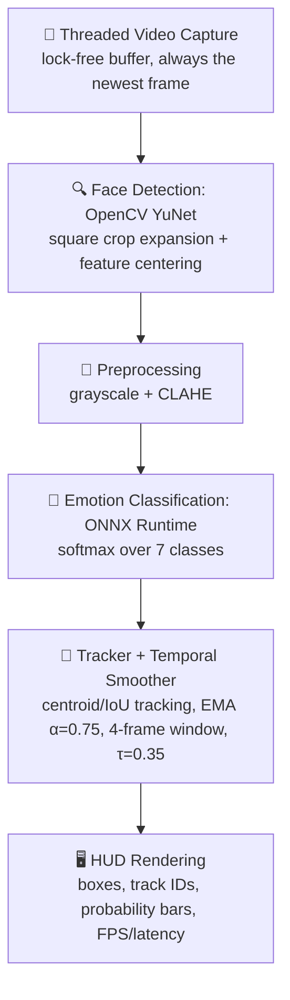

<div align="center">

# 🎭 emotion-live

### Real-time facial emotion recognition on a plain CPU — no GPU required

Detects faces, tracks them across frames, and classifies **7 emotions** from a live webcam feed at **50+ FPS** with under **20 ms** end-to-end latency.


</div>

---

## 📑 Table of Contents

- [Highlights](#-highlights)
- [Performance at a Glance](#-performance-at-a-glance)
- [How It Works](#-how-it-works)
- [Quick Start](#-quick-start)
- [Usage](#-usage)
- [Benchmarks](#-benchmarks)
- [Model Training & Evaluation](#-model-training--evaluation)
- [Project Structure](#-project-structure)
- [Testing & Verification](#-testing--verification)
- [Limitations](#-limitations)
- [Privacy](#-privacy)
- [Author](#-author)

---

## ✨ Highlights

- ⚡ **Fast on CPU** — 51.6–56.4 FPS on a 12-thread laptop CPU, about 2.5× the 20 FPS target.
- 🧵 **Zero-lag capture** — a dedicated daemon thread always hands the pipeline the newest frame and drops stale ones.
- 🎯 **Clean face crops** — centered square expansion removes aspect-ratio squashing and keeps neck and clothing out of the frame.
- 🌗 **Robust preprocessing** — grayscale + CLAHE to close the domain gap between webcam footage and FER2013 training data.
- 👥 **Multi-face tracking** — persistent track IDs via centroid + IoU matching.
- 🧘 **Flicker-free labels** — EMA smoothing, a rolling window, and a confidence threshold; low-confidence faces show *Uncertain*.
- 📊 **Live HUD** — color-coded boxes, a 7-bar probability panel, FPS, latency, and per-stage timing.
- 🔒 **Private by design** — everything runs locally; nothing is uploaded or stored unless you ask.

**Emotions recognized:** `angry` · `disgust` · `fear` · `happy` · `neutral` · `sad` · `surprise`

---

## 📈 Performance at a Glance

Measured on an Intel 12-thread laptop CPU with **no GPU acceleration**.

| Metric | Target | Measured (ONNX Runtime, CPU) | Status |
| :--- | :---: | :---: | :---: |
| Pipeline throughput | ≥ 20 FPS | **51.6 – 56.4 FPS** | ✅ 2.5× – 2.8× target |
| End-to-end latency | < 100 ms | **17.74 – 19.40 ms** (P95: 22.64 ms) | ✅ |
| Classification latency | — | **1.94 – 4.98 ms** | ✅ ~6.8× faster than PyTorch CPU |
| Label stability | No flicker | **0 flicker transitions** over 15 jittered frames | ✅ |
| Automated tests | 100% pass | **11 / 11 passed** | ✅ |
| FER2013 test accuracy | ≥ 65% | **59.85%** | ⚠️ Below target — see [Limitations](#-limitations) |
| FER2013 macro-F1 | ≥ 0.58 | **0.5533** | ⚠️ Below target — see [Limitations](#-limitations) |

---

## 🧠 How It Works



| Stage | What it does |
| :--- | :--- |
| **Capture** | A daemon thread with a lock-free buffer drops stale frames so the pipeline never lags behind the camera. |
| **Detection** | OpenCV's YuNet ONNX detector (`cv2.FaceDetectorYN`) finds faces. Crops are expanded to a centered square to avoid squashing. |
| **Preprocessing** | Grayscale removes chrominance mismatch with FER2013; CLAHE evens out lighting. |
| **Classification** | ONNX Runtime runs the model with intra-op CPU thread pools and returns softmax probabilities. |
| **Tracking & smoothing** | Centroid + IoU matching keeps identities stable. EMA (α = 0.75) plus a 4-frame rolling window suppresses flicker. Predictions under τ = 0.35 are shown as *Uncertain*. |
| **HUD** | Draws color-coded boxes, persistent IDs, a live 7-bar probability panel, and per-stage profiling. |

---

## 🚀 Quick Start

**Prerequisites**

- Python 3.10, 3.11, or 3.12
- A webcam *(optional — a synthetic mode is included for headless setups)*

**Install**

```bash
git clone https://github.com/ayushmansatapathy/emotion.git
cd emotion
pip install -r requirements.txt
```

**Run**

```bash
python realtime.py --source 0
```

---

## 🎮 Usage

### Input sources

```bash
# Live webcam
python realtime.py --source 0

# Synthetic animated face (great for automated testing / headless machines)
python realtime.py --source synthetic

# Pre-recorded video file
python realtime.py --source path/to/video.mp4
```

### Keyboard shortcuts

| Key | Action |
| :---: | :--- |
| `q` | Quit cleanly |
| `s` | Save a timestamped high-resolution snapshot to `screenshots/` |
| `r` | Start / stop recording the live output to `videos/` |

---

## ⏱️ Benchmarks

Benchmarked over 100 consecutive frames at 640×480 on CPU.

| Pipeline Stage | PyTorch CPU | ONNX Runtime CPU | Speedup |
| :--- | :---: | :---: | :---: |
| Capture (threaded I/O) | 0.10 ms | 0.09 ms | 1.1× |
| Face detection (YuNet) | 19.12 ms | 17.13 ms | 1.1× |
| Preprocessing (square crop + CLAHE) | 0.01 ms | 0.01 ms | 1.0× |
| **Emotion classification** | **13.33 ms** | **1.94 ms** | **6.8×** |
| HUD drawing & rendering | 0.25 ms | 0.23 ms | 1.1× |
| **Total end-to-end latency** | **32.82 ms** | **19.40 ms** | **1.69×** |
| **Throughput** | **30.5 FPS** | **51.6 FPS** | **+69.2%** |

Switching from PyTorch to ONNX Runtime accelerates classification by ~6.8×, and face detection is now the dominant cost in the pipeline.

Reproduce the results:

```bash
python benchmarks/benchmark_pipeline.py
```

---

## 🏋️ Model Training & Evaluation

### Dataset

**FER2013** — Train: 28,709 · PublicTest: 3,589 · PrivateTest: 3,589

- **Class balancing:** FER2013 is heavily imbalanced (Disgust has 436 training samples vs. 7,215 for Happy), so training uses inverse-frequency class weights:

  $$w_c = \left(\frac{N}{K \cdot N_c}\right)^{0.5}$$

- **Augmentation:** random horizontal flip (p = 0.5), rotation (±15°), color jitter (brightness, contrast, saturation), and random affine translations.
- **Training setup:** cosine-annealing learning-rate schedule with label smoothing.

### Results — PrivateTest split (3,589 samples)

| Emotion | Precision | Recall | F1-Score | Support |
| :--- | :---: | :---: | :---: | :---: |
| 😄 Happy | 0.8196 | 0.8271 | **0.8233** | 879 |
| 😲 Surprise | 0.7246 | 0.6514 | **0.6861** | 416 |
| 😐 Neutral | 0.5596 | 0.6150 | **0.5860** | 626 |
| 😠 Angry | 0.4841 | 0.5275 | **0.5049** | 491 |
| 😢 Sad | 0.4559 | 0.5051 | **0.4792** | 594 |
| 😨 Fear | 0.4718 | 0.3485 | **0.4009** | 528 |
| 🤢 Disgust | 0.3860 | 0.4000 | **0.3929** | 55 |
| **Macro average** | **0.5574** | **0.5535** | **0.5533** | **3,589** |
| **Overall accuracy** | — | — | **59.85%** | **3,589** |

### Confusion matrix

The normalized confusion matrix is exported to [`reports/confusion_matrix.png`](reports/confusion_matrix.png).

- Strongest classes: **Happy (83%)**, **Surprise (65%)**, **Neutral (62%)**.
- Most confusion occurs between neighbouring negative expressions (*Sad* vs. *Neutral*, *Fear* vs. *Angry*), which is consistent with published FER benchmark findings.

---

## 🗂️ Project Structure

```
emotion-live/
├── data/                                 # Cached dataset archives (train / val / test .npz)
├── models/
│   ├── emotion-ferplus-8.onnx            # High-accuracy ONNX model
│   ├── emotion_model.onnx                # Fine-tuned MobileNetV3 ONNX model
│   ├── best_emotion_model.pth            # PyTorch training checkpoint
│   └── face_detection_yunet_2023mar.onnx # YuNet face detector weights
├── src/
│   ├── dataset.py                        # Dataset loading, augmentation, class balancing
│   ├── model.py                          # Network architecture definitions
│   ├── train.py                          # Training loop (cosine annealing, label smoothing)
│   ├── evaluate.py                       # Metrics + confusion matrix generation
│   ├── detector.py                       # Face detector with square crop & landmark centering
│   ├── predict.py                        # ONNX Runtime inference + CLAHE preprocessing
│   ├── tracker.py                        # Centroid + IoU multi-face tracker
│   └── smoothing.py                      # EMA + rolling-window temporal smoothing
├── benchmarks/
│   └── benchmark_pipeline.py             # Latency profiling and FPS benchmarking
├── tests/
│   ├── test_model.py                     # Architecture & output-shape tests
│   ├── test_detector.py                  # Face detector boundary-clamping tests
│   ├── test_smoothing.py                 # Anti-flicker & confidence-threshold tests
│   ├── test_pipeline.py                  # Full live-pipeline integration tests
│   ├── test_benchmark.py                 # FPS and latency assertions
│   ├── verify_phase4.py                  # 65 s continuous feed & edge-case verification
│   └── verify_phase5_stability.py        # Noise-jitter stability & anti-bias verification
├── reports/                              # Confusion matrix, sample outputs
├── realtime.py                           # Main real-time application
├── PROGRESS.md                           # Phased iteration log & experiment history
├── requirements.txt
└── README.md
```

---

## ✅ Testing & Verification

**Unit & integration tests**

```bash
python -m pytest -v tests/
```

**Speed & latency benchmark**

```bash
python benchmarks/benchmark_pipeline.py
```

**Edge-case & stability suite** — checks a continuous 65 s run for memory leaks, pitch-black frames, multi-face tracking, and boundary clipping:

```bash
python tests/verify_phase4.py
```

---

## ⚠️ Limitations

1. **FER2013 label noise.** Roughly 10–15% of FER2013 annotations are noisy or contested, and human agreement on the dataset is only about 65% ± 5% (images are 48×48 and often ambiguous). This puts a natural ceiling on the accuracy any model can reach on this benchmark, and is a key reason the reported 59.85% falls short of the 65% target.
2. **Expression ≠ emotion.** The model reads outward facial configurations (Facial Action Units), which don't always reflect a person's internal emotional state.
3. **Lighting and head pose.** Head rotations beyond ~45° (pitch or yaw) reduce detection confidence. CLAHE helps in low light, but severe under-exposure still needs some ambient illumination.
4. **Rare classes.** *Disgust* (55 test samples) and *Fear* score lowest; expect weaker predictions on these.

---

## 🔒 Privacy

- **Strictly local.** Capture, detection, tracking, and classification all run on your device. No frames, audio, or biometric features are sent anywhere.
- **Nothing saved by default.** Frames live only in volatile memory. Media is written to disk only when you explicitly press `s` (screenshot) or `r` (record).

---

## 👤 Author

**Ayushman Satapathy** — AI/ML Engineer

[](https://github.com/ayushmansatapathy)
[](https://linkedin.com/in/ayushmansatapathy)

---

<div align="center">

If you found this project useful, consider giving it a ⭐

</div>
